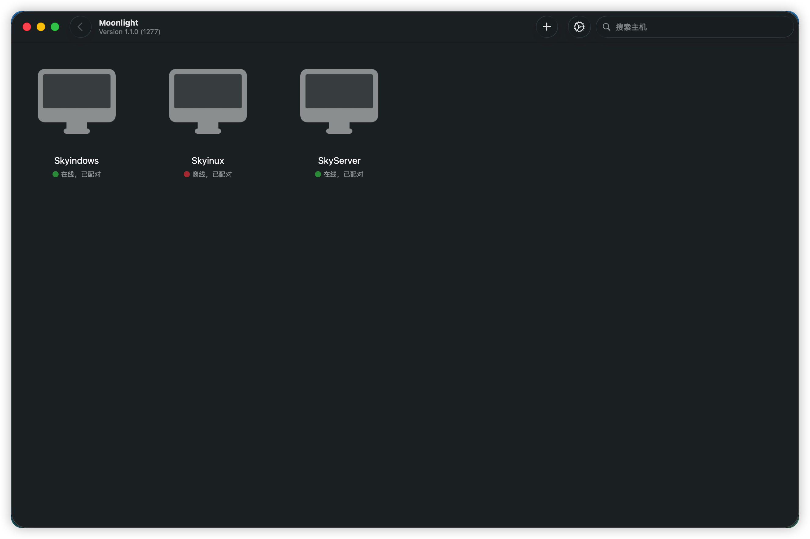
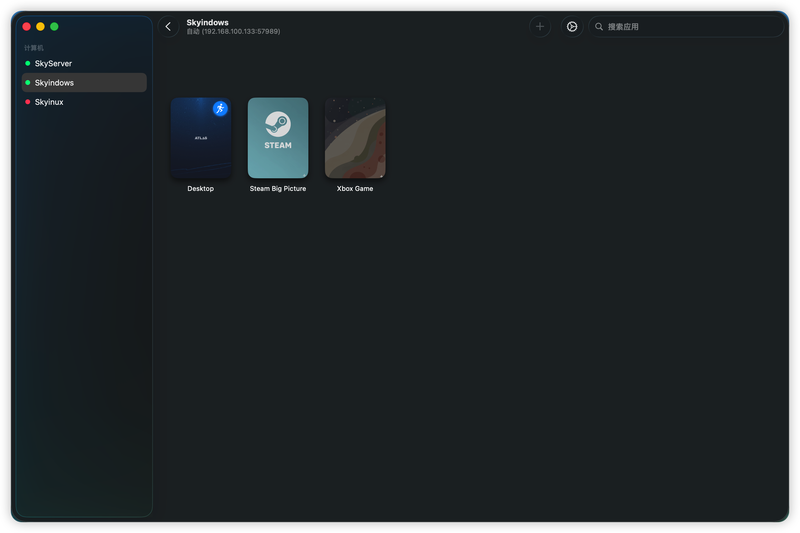
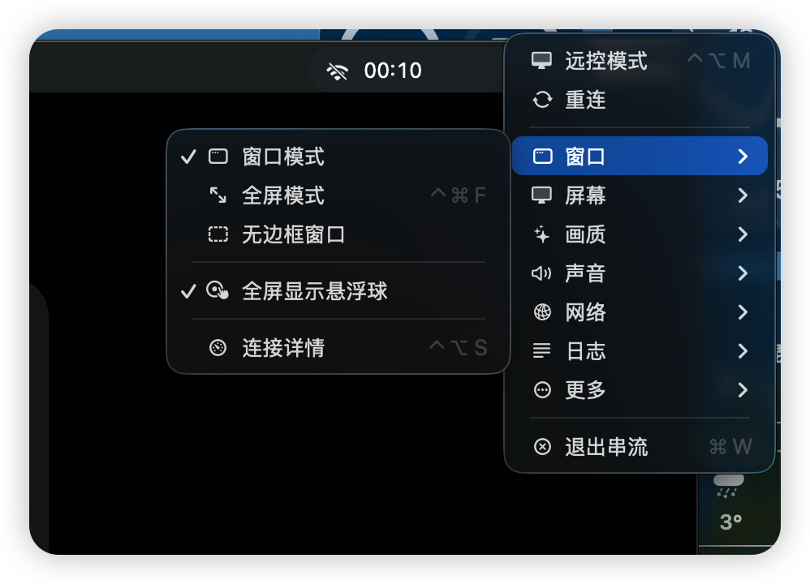
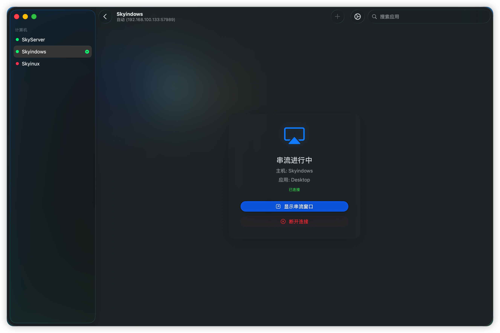
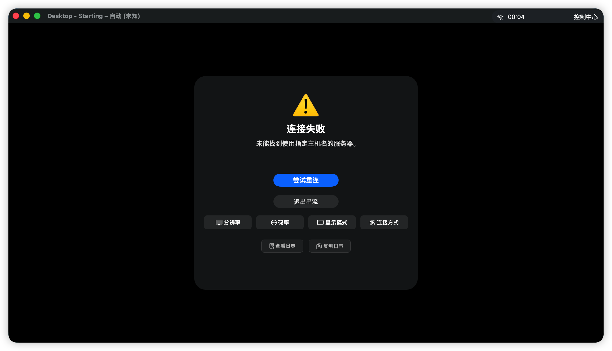
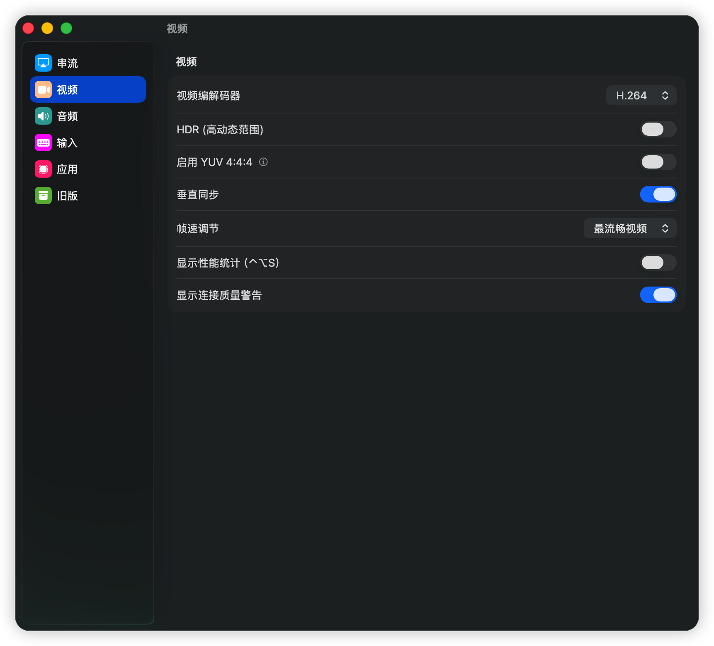
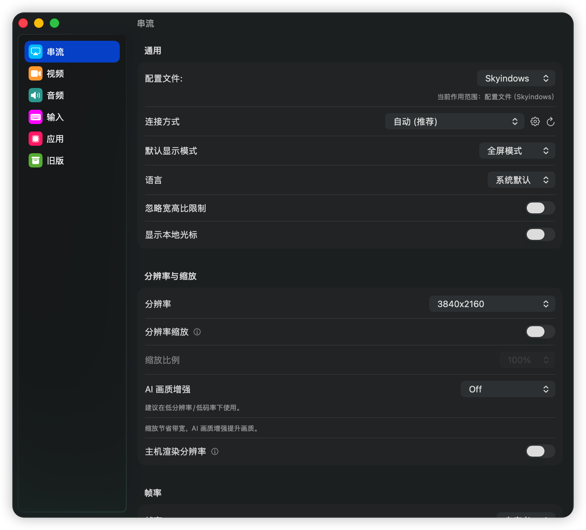

# Moonlight macOS Enhanced

<div align="center">

[](https://github.com/skyhua0224/moonlight-macos-enhanced/actions/workflows/build.yml) [](https://github.com/skyhua0224/moonlight-macos-enhanced/releases) [](https://github.com/skyhua0224/moonlight-macos-enhanced/releases) []() [](LICENSE.txt)

**原生 macOS 游戏串流客户端**

一款原生 macOS 游戏串流客户端，使用 AppKit/SwiftUI 构建。结合原生 Mac 应用的流畅体验与社区增强版的强大功能。

简体中文 | [English](README.en.md)

</div>

---

## ✨ 核心特性

### 🍎 原生 macOS 体验
- **Apple Silicon 优化** - 原生支持 Apple Silicon 芯片
- **原生界面** - 使用 AppKit/SwiftUI 构建，非 Qt 移植
- **深色模式** - 完整支持系统深色模式
- **多语言** - 支持简体中文和英文

### 🎮 串流性能
- **自定义分辨率和帧率** - 可配置分辨率和刷新率
- **HEVC/H.264** - 硬件加速视频解码
- **HDR** - 高动态范围支持
- **YUV 4:4:4** - 增强色彩采样（需要 Foundation Sunshine）
- **垂直同步** - V-Sync 支持
- **环绕声** - 5.1/7.1 音频支持

### 🚀 增强功能（新增特性）
| 功能 | 说明 |
|------|------|
| 🎤 **麦克风直通** | 将麦克风音频传输到主机（需要 Foundation Sunshine） |
| 📊 **性能浮窗** | 实时显示延迟、帧率、码率等信息（⌃⌥S 切换） |
| 🖥️ **多主机同时串流** | 同时连接多台主机 |
| 🎨 **MetalFX 画质增强** | Apple AI 超分辨率技术 |
| 🌐 **自定义端口/IPv6/域名** | 灵活的连接选项 |
| 🔧 **连接方式管理** | 为每台主机管理多个连接方式 |
| 🎮 **手柄鼠标模式** | 用手柄模拟鼠标操作 |
| ⚡ **自动码率** | 根据网络状况自适应调整 |
| 🖼️ **显示模式** | 全屏 / 无边框 / 窗口化 |
| 🔄 **智能重连** | 自动重连并处理超时 |

### 🖥️ 主机端兼容性

| 主机软件 | 兼容性 | 备注 |
|----------|--------|------|
| [Foundation Sunshine](https://github.com/qiin2333/foundation-sunshine) | ⭐ 推荐 | 支持全部功能（麦克风、YUV444 等） |
| [Sunshine (LizardByte)](https://github.com/LizardByte/Sunshine) | ✅ 支持 | 部分高级功能不可用 |
| GeForce Experience | ⚠️ 基础支持 | 已停止更新，不支持麦克风 |

> 💡 **麦克风、YUV 4:4:4** 等高级功能需要配合 [Foundation Sunshine](https://github.com/qiin2333/foundation-sunshine) 使用

### 📸 截图

| 主机列表 | 应用列表 |
|:--------:|:--------:|
|  |  |

| 性能浮窗 | 连接管理 |
|:--------:|:--------:|
|  |  |

| 串流中遮罩 | 连接错误 |
|:----------:|:--------:|
|  |  |

| 视频设置 | 串流设置 |
|:--------:|:--------:|
|  |  |

### ⌨️ 快捷键

| 快捷键 | 功能 |
|--------|------|
| `Ctrl` + `Option` | 释放鼠标 |
| `Ctrl` + `Option` + `S` | 切换性能浮窗 |
| `Ctrl` + `Option` + `W` | 断开连接 |
| `Ctrl` + `Shift` + `W` | 退出应用 |

### 🛠️ 安装

#### 下载发布版
从 [Releases](https://github.com/skyhua0224/moonlight-macos-enhanced/releases) 下载最新的 `.dmg` 文件。

> ⚠️ **此应用未经公证签名。** 首次启动时：
> - 右键点击应用，选择"打开"，或
> - 前往 系统设置 → 隐私与安全性 → 仍要打开，或
> - 在终端运行：`xattr -cr /Applications/Moonlight.app`

#### 从源码构建

1. 克隆仓库：
   ```bash
   git clone --recursive https://github.com/skyhua0224/moonlight-macos-enhanced.git
   cd moonlight-macos-enhanced
   ```

2. 下载 XCFramework 依赖：
   ```bash
   curl -L -o xcframeworks.zip "https://github.com/coofdy/moonlight-mobile-deps/releases/download/latest/moonlight-apple-xcframeworks.zip"
   unzip -o xcframeworks.zip -d xcframeworks/
   ```

3. 在 Xcode 中打开 `Moonlight.xcodeproj`

4. 前往 **Signing & Capabilities** 标签页，将 **Team** 改为你自己的开发者账号

5. 将 **Bundle Identifier** 改为你自己的标识符（如 `com.yourname.MoonlightMac`）

6. 选择 **Moonlight for macOS** scheme，目标选择 **My Mac**，按 ⌘R 构建运行

### 📅 更新策略

本项目为个人业余时间维护：
- 🐛 严重 Bug 和闪退问题优先修复
- 💡 有空闲时间或看到好建议时会添加新功能
- 📥 欢迎提交 Issue 和 PR，但响应时间不固定

> 我自己每天都在使用这个应用，所以会持续保持它的正常运行！

### 🐛 问题反馈

提交 Bug 时请包含：
- macOS 版本（如 macOS 14.2）
- 芯片类型（Intel / M1 / M2 / M3 / M4）
- 主机端软件及版本（Sunshine / Foundation Sunshine / GFE）
- 复现步骤
- 相关日志或截图

### 🤝 贡献代码

欢迎提交 PR！请：
- 遵循现有代码风格
- 测试你的更改
- 提供清晰的描述

---

## 📬 联系方式

- 📧 Email: [dev@sky-hua.xyz](mailto:dev@sky-hua.xyz)
- 💬 Telegram: [@skyhua](https://t.me/skyhua)
- 🐧 QQ: 2110591491
- 🔗 GitHub Issues: [提交 Issue](https://github.com/skyhua0224/moonlight-macos/issues)

> 💡 建议使用 GitHub Issues 提交问题和建议

---

## 🙏 致谢

本项目基于以下优秀的开源项目构建：

### 核心项目
- **[moonlight-macos](https://github.com/MichaelMKenny/moonlight-macos)** by MichaelMKenny - 原生 macOS 客户端基础
- **[moonlight-common-c](https://github.com/moonlight-stream/moonlight-common-c)** by Moonlight Team - 核心串流协议

### 功能参考
- **[Foundation Sunshine](https://github.com/qiin2333/foundation-sunshine)** by qiin2333 - 支持麦克风的增强主机端
- **[moonlight-qt](https://github.com/moonlight-stream/moonlight-qt)** by Moonlight Team - 官方跨平台客户端

### 依赖库
- [SDL2](https://www.libsdl.org/) - 输入处理
- [OpenSSL](https://www.openssl.org/) - 加密
- [MASPreferences](https://github.com/shpakovski/MASPreferences) - 设置界面

---

## 📄 许可证

本项目采用 [GPLv3 许可证](LICENSE.txt)。
