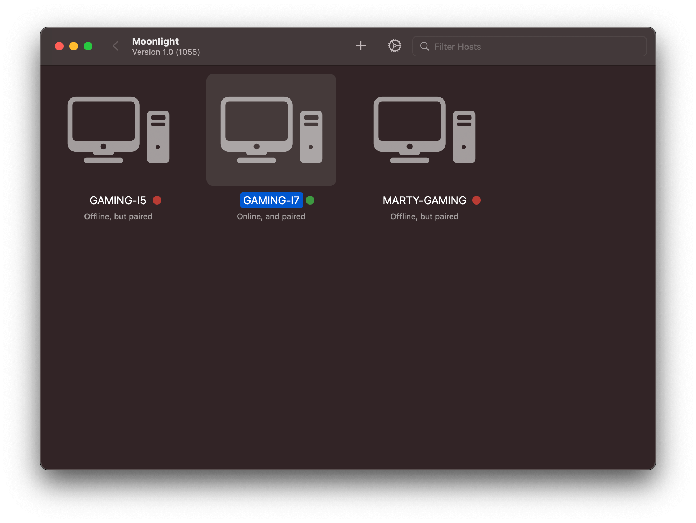
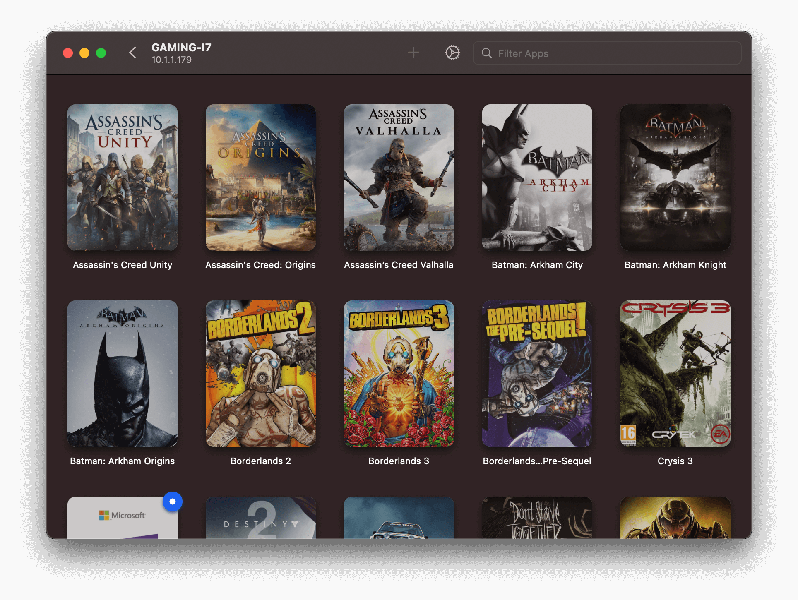
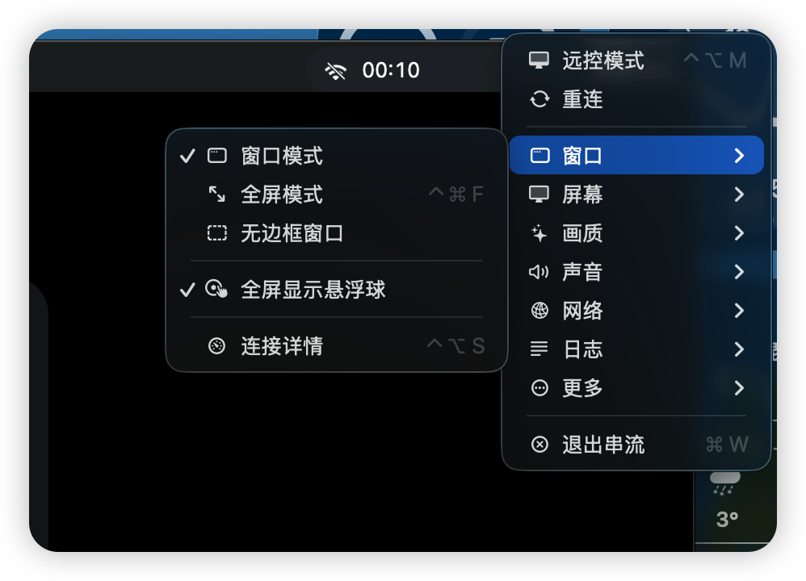
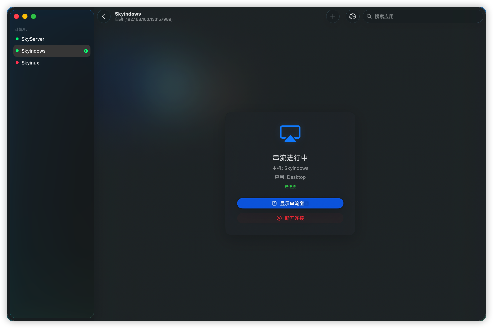
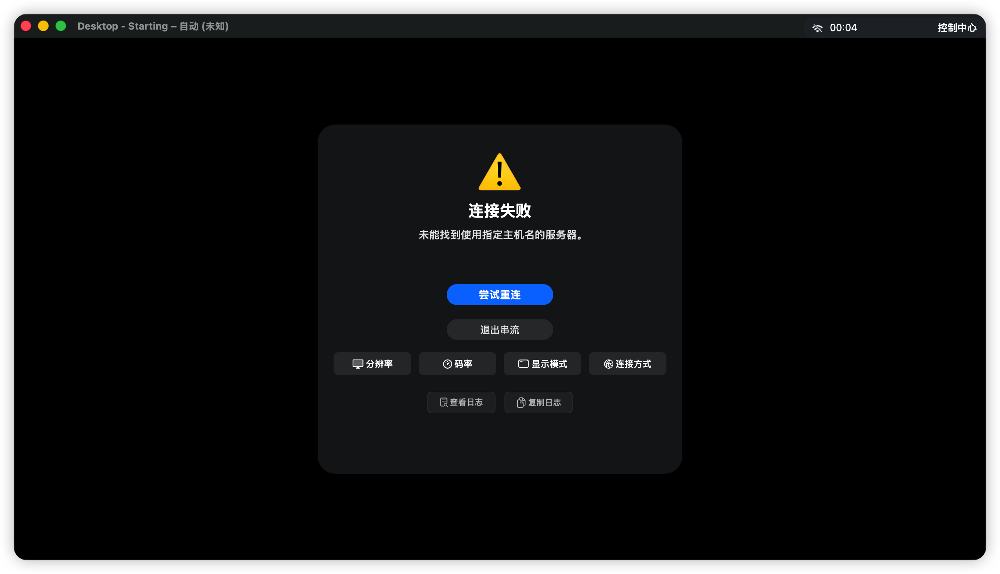
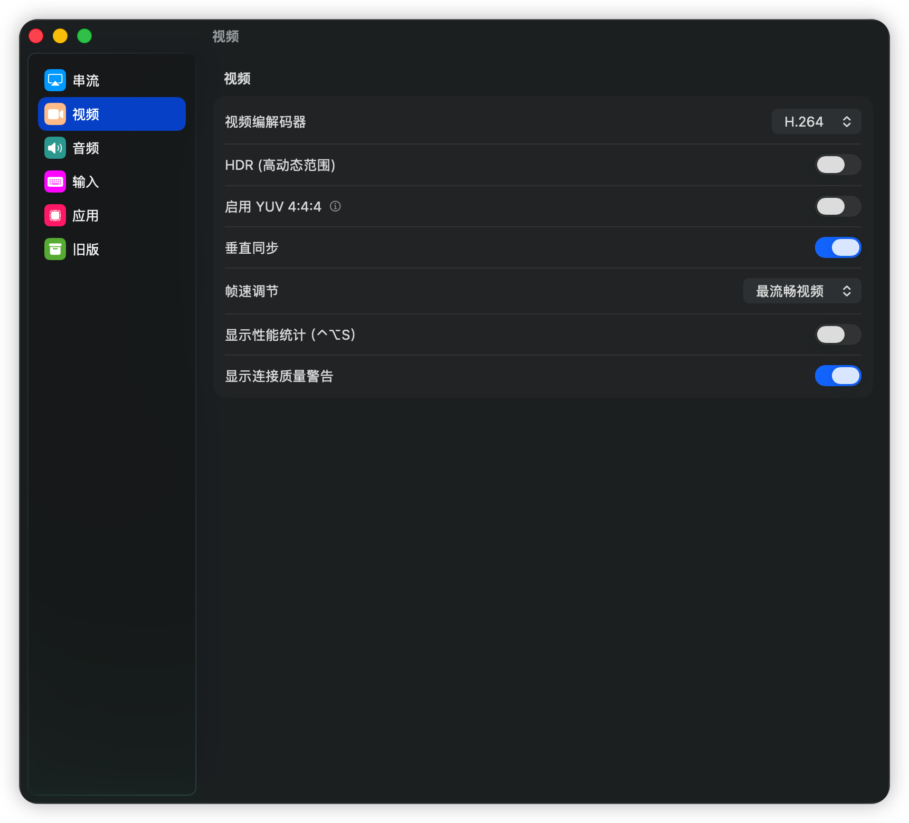
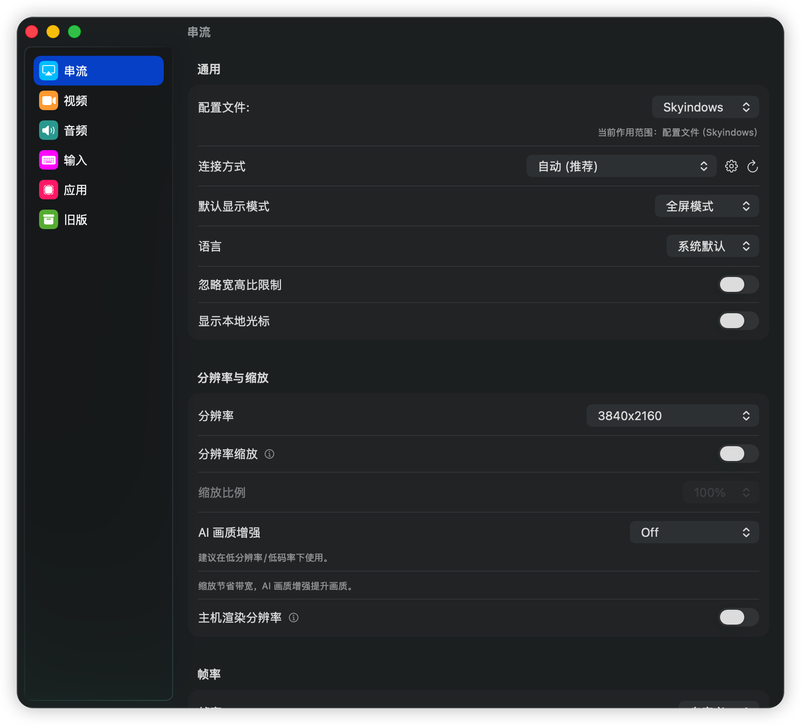

# Moonlight macOS Enhanced

<div align="center">

[](https://github.com/skyhua0224/moonlight-macos-enhanced/actions/workflows/build.yml) [](https://github.com/skyhua0224/moonlight-macos-enhanced/releases) [](https://github.com/skyhua0224/moonlight-macos-enhanced/releases) []() [](LICENSE.txt)

**Moonlight macOS / Moonlight for macOS 原生增强版客户端**

`Moonlight macOS Enhanced` 是一个面向 Sunshine、Foundation Sunshine 与兼容 GameStream 主机的原生 macOS 串流客户端，使用 AppKit / SwiftUI 构建，并针对 Apple Silicon 与 Intel Mac 做了持续优化。

简体中文 | [English](README.en.md)

</div>

---

## ✨ 核心特性

- **原生 macOS 客户端** — AppKit / SwiftUI 界面、Apple Silicon / Intel 双支持、深色模式与双语界面
- **完整串流能力** — 自定义分辨率与帧率、AV1 / HEVC / H.264 解码、HDR、YUV 4:4:4、MetalFX / VT 增强与自动码率
- **多渲染链路** — 自动模式优先 `原生渲染器`，并可在 `Metal 渲染器` 与 `兼容渲染器` 间切换
- **输入与控制增强** — 自由鼠标 / 锁定鼠标、Automatic 驱动策略、可自定义串流快捷键、手柄增强
- **视音频体验升级** — 低延迟本地音频播放链路、多通道接收与播放、音效增强模式、麦克风链路增强
- **连接与稳定性** — 每台主机独立连接方式、自定义端口 / IPv6 / 域名、性能浮窗、诊断日志、AWDL 稳定性辅助

<details>
<summary><strong>视频 / HDR / 渲染链路</strong></summary>

- 视频协商覆盖 `AV1 / HEVC / H.264`、HDR、YUV `4:4:4`、远端分辨率 / FPS 覆盖与自动码率调节
- `自动` 模式固定顺序为：`原生渲染器 → Metal 渲染器 → 兼容渲染器`
- `原生渲染器` 使用 `VideoToolbox 解码 + 原生 Sample Buffer 呈现`，主打最低延迟、最高默认色准与稳定 HDR 播放体验
- `Metal 渲染器` 使用更深的 `Metal / EDR` 呈现链路，提供 `HLG / PQ`、HDR 元数据来源、本机显示器 HDR 档案、亮度参数、光学输出倍率、HLG 观看环境、EDR 策略、色调映射策略等专业调节
- `Metal 渲染器` 同时提供显示同步、帧队列目标、响应倾向与 drawable timeout 等呈现时序调节项
- 画质增强链路可按能力与场景使用 `VT 低延迟超分`、`VT 高质量超分`、`MetalFX`、`基础缩放` 与 `VT 低延迟插帧`，并在不可用时自动回退

</details>

<details>
<summary><strong>音频 / 麦克风链路</strong></summary>

- 默认播放路径已经升级为更贴近 `Core Audio` 的低额外缓冲本地播放链路，并保留兼容 fallback
- 支持接收主机侧 `Opus multistream` 音频，并完成 `2ch / 5.1 / 7.1 / 7.1.4` 的本地解码、协商与播放
- 在真实多通道输出设备上优先保留多通道语义；在耳机与 `2.0 / 2.1` 音箱上可切换 `音效增强`，由客户端侧完成空间感、音场、混响与 EQ 重渲染
- `音效增强` 提供预设、手动均衡器、空间强度、音场宽度与混响调节，适合耳机和立体声设备的本地听感增强
- 配合支持相关能力的 Foundation Sunshine，可使用更完整的多通道协商、麦克风 uplink 与相关增强链路

</details>

<details>
<summary><strong>主机协作 / 输入 / 诊断</strong></summary>

- 鼠标输入默认支持 `Automatic` 路由，顺序为 `CoreHID → HID → MFI`；在支持系统上会优先尝试 `CoreHID` 高回报率相对移动，并在权限或系统条件不足时自动回退
- 输入链路覆盖 `自由鼠标 / 锁定鼠标`、键盘与快捷键翻译、物理滚轮 / 平滑滚轮 / 触控板分流策略、多手柄、震动、Guide 模拟与手柄鼠标
- 可向 Foundation Sunshine 发送 `display_name`、`useVdd`、`customScreenMode` 与 HDR 显示参数覆盖
- 网络与主机协作支持自定义端口、IPv6、域名连接、每台主机独立连接方式，以及 `AWDL`、连接警告、性能浮窗、输入诊断、原始 / 浓缩日志等稳定性工具

</details>

## 🖥️ 主机端兼容性

| 主机软件 | 兼容性 | 备注 |
|----------|--------|------|
| [Foundation Sunshine](https://github.com/qiin2333/foundation-sunshine) | ⭐ 推荐 | 支持麦克风、YUV 4:4:4、多通道音频等完整增强能力 |
| [Sunshine (LizardByte)](https://github.com/LizardByte/Sunshine) | ✅ 支持 | 大部分功能可用，部分增强能力受限 |
| GeForce Experience | ⚠️ 基础支持 | 已停止维护，不支持麦克风等新能力 |

> 💡 麦克风、YUV 4:4:4、部分输入与音频增强能力更适合配合 [Foundation Sunshine](https://github.com/qiin2333/foundation-sunshine) 使用。

## 📦 下载

- 从 [Releases](https://github.com/skyhua0224/moonlight-macos-enhanced/releases) 下载最新版本
- 发布页提供三种安装包：`universal`、`arm64`、`x86_64`
- 如果你不清楚它们之间的区别，默认推荐下载 `universal`

## 📸 截图

| 主机列表 | 应用列表 |
|:--------:|:--------:|
|  |  |

| 性能浮窗 | 连接管理 |
|:--------:|:--------:|
|  |  |

| 串流中遮罩 | 连接错误 |
|:----------:|:--------:|
|  |  |

| 视频设置 | 串流设置 |
|:--------:|:--------:|
|  |  |

## 🔊 视音频能力

### 视频链路
- 支持自定义分辨率、帧率、远端分辨率与远端帧率覆盖
- 视频协商覆盖 `AV1 / HEVC / H.264`、HDR、YUV `4:4:4` 与自动码率调节
- 提供 `原生渲染器 / Metal 渲染器 / 兼容渲染器` 三条视频呈现链路，并由自动模式按顺序回退
- `原生渲染器` 面向最低延迟与最高默认色准；`Metal 渲染器` 面向更深的 HDR 与色彩调节；`兼容渲染器` 面向旧系统和异常恢复

### HDR / 色彩 / 画质增强
- HDR 传输函数支持 `HLG / PQ / Auto`，并提供更贴近当前显示器的客户端侧 HDR 呈现策略
- `Metal 渲染器` 支持 HDR 元数据来源、本机显示器 HDR 配置、亮度参数、光学输出倍率、HLG 观看环境、EDR 策略与色调映射策略
- 画质增强链路支持 `VT 低延迟超分`、`VT 高质量超分`、`MetalFX` 与 `基础缩放`
- `VT 低延迟插帧` 也已接入到 Metal 视频链路中，用于高刷新率显示器下的画面节奏增强

### 音频链路
- 默认音频链路使用更贴近 `Core Audio` 的低延迟本地播放路径，并保留兼容回退
- 支持 `2ch / 5.1 / 7.1 / 7.1.4` 多通道音频接收、协商与本地播放
- 当输出设备本身支持多通道时，优先保留真实多通道播放；当输出设备为耳机或 `2.0 / 2.1` 音箱时，可切换 `音效增强`
- `音效增强` 面向耳机与立体声设备提供客户端侧空间感、音场、混响与均衡器调节，并支持预设与手动参数
- 配合支持相关能力的 [Foundation Sunshine](https://github.com/qiin2333/foundation-sunshine) 时，可使用增强后的麦克风 uplink 与更完整的多通道协商路径

## 🖱️ 输入与控制

### 默认行为
- **鼠标模式默认：自由鼠标**
- **鼠标驱动默认：Automatic**
- **Automatic 顺序：CoreHID → HID → MFI**

### 鼠标模式
- **锁定鼠标**：更适合游戏、FPS、需要持续相对移动的场景
- **自由鼠标**：更适合远控、多屏切换、桌面应用操作

### 鼠标 / 滚轮链路
- 在支持系统上，`CoreHID` 负责更高回报率的相对鼠标输入；若权限未授予或运行时不可用，会自动回退到 `HID / MFI / AppKit` 兼容路径
- 支持本地光标、指针速度、左右键交换、反转滚动与 `CoreHID` 报告率上限
- 滚轮链路按来源拆分为 `物理滚轮`、`改写 / 平滑滚轮` 与 `触控板` 三类独立策略
- 物理滚轮支持自动、高精度、分段等模式，并可独立调节距离、速度与尾迹过滤

### 键盘 / 手柄 / 快捷键
- 键盘链路支持常用 Windows 快捷键翻译、自定义快捷键翻译规则与 Moonlight 自定义串流快捷键
- 手柄链路支持多手柄、震动、Guide 模拟与手柄模拟鼠标
- 鼠标、键盘、手柄设置页已经按使用场景重整，常用输入选项更集中

### 串流快捷键
以下 Moonlight 自定义串流快捷键支持在 `设置 → 输入 → 键盘` 中调整：

| 快捷键 | 功能 | 说明 |
|--------|------|------|
| `Ctrl` + `Option` | 释放鼠标捕获 | 串流窗口中 |
| `Ctrl` + `Option` + `S` | 切换性能浮窗 | 串流窗口中 |
| `Ctrl` + `Option` + `M` | 切换鼠标模式 | 串流窗口中 |
| `Ctrl` + `Option` + `G` | 切换全屏悬浮球 | 全屏模式 |
| `Ctrl` + `Option` + `W` | 断开串流 | 串流窗口中 |
| `Ctrl` + `Shift` + `W` | 断开并退出应用 | 串流窗口中 |
| `Ctrl` + `Option` + `C` | 打开控制中心 | 仅全屏 / 无边框 |
| `Ctrl` + `Option` + `Command` + `B` | 无边框 / 窗口切换 | 高级排障快捷键 |

> 💡 这里列的是 Moonlight 自定义串流快捷键；标准 macOS 快捷键如 `⌘W`、`⌃⌘F` 不在此表内。

## 🔧 连接、诊断与稳定性

- 每台主机支持独立连接方式管理
- 支持自定义端口、IPv6 与域名连接
- 提供性能浮窗、连接警告与输入诊断
- 同时提供原始日志与浓缩日志，便于排障
- 提供 AWDL 稳定性辅助项、自动重连与超时恢复能力

## 🛠️ 安装

### 下载发布版
从 [Releases](https://github.com/skyhua0224/moonlight-macos-enhanced/releases) 下载最新 `.dmg`。

> ⚠️ 此应用当前未做 Apple 公证。若 macOS 提示“Moonlight.app 已损坏”或阻止打开，通常是 Gatekeeper 拦截未公证应用，并不一定代表文件真的损坏。
>
> 首次启动建议按这个顺序尝试：
> 1. 右键应用，选择“打开”
> 2. 前往 **系统设置 → 隐私与安全性**，选择“仍要打开”
> 3. 若仍被拦截，执行：
>    `xattr -dr com.apple.quarantine /Applications/Moonlight.app`

### 从源码构建

```bash
git clone --recursive https://github.com/skyhua0224/moonlight-macos-enhanced.git
cd moonlight-macos-enhanced

curl -L -o xcframeworks.zip "https://github.com/coofdy/moonlight-mobile-deps/releases/download/latest/moonlight-apple-xcframeworks.zip"
unzip -o xcframeworks.zip -d xcframeworks/
```

然后：
1. 用 Xcode 打开 `Moonlight.xcodeproj`
2. 在 **Signing & Capabilities** 中改成你自己的 Team
3. 按需修改 Bundle Identifier
4. 选择 **Moonlight for macOS** scheme 后运行

## 🐛 问题反馈

提交 Bug 时建议包含：
- macOS 版本
- 机型 / 芯片类型
- 主机端软件及版本
- 是否使用了 Mos、BetterMouse、SteerMouse 等第三方鼠标工具
- 复现步骤
- 日志或截图

若是输入 / 滚轮 / 鼠标问题，建议附带：
- `设置 → App → Debug Log` 导出的日志
- 你使用的是 **自由鼠标** 还是 **锁定鼠标**
- 你使用的是 **Automatic / CoreHID / HID / MFI** 中哪条路径

## 🤝 贡献

欢迎提交 Issue 和 PR。建议：
- 保持中英文用户文案同步
- 提交前至少验证核心串流与输入路径
- PR 描述优先写用户可感知变化，而不是只贴 commit 标题

## 📬 联系方式

- 📧 Email: [dev@sky-hua.xyz](mailto:dev@sky-hua.xyz)
- 💬 Telegram: [@skyhua](https://t.me/skyhua)
- 🐧 QQ: 2110591491
- 🔗 GitHub Issues: [提交 Issue](https://github.com/skyhua0224/moonlight-macos-enhanced/issues)

## 🙏 致谢

完整致谢、上游来源与生态参考请见 [ACKNOWLEDGEMENTS.md](ACKNOWLEDGEMENTS.md)。

- 直接代码基础：`moonlight-macos`、`moonlight-ios`、`moonlight-common-c`
- 功能与行为参考：`moonlight-qt`、`qiin2333/moonlight-qt`
- 主机端生态参考：`Sunshine`、`foundation-sunshine`
- 输入与滚轮体验参考：`Mos`、`Mouser`

## 📄 许可证

本项目采用 [GPLv3 许可证](LICENSE.txt)。
